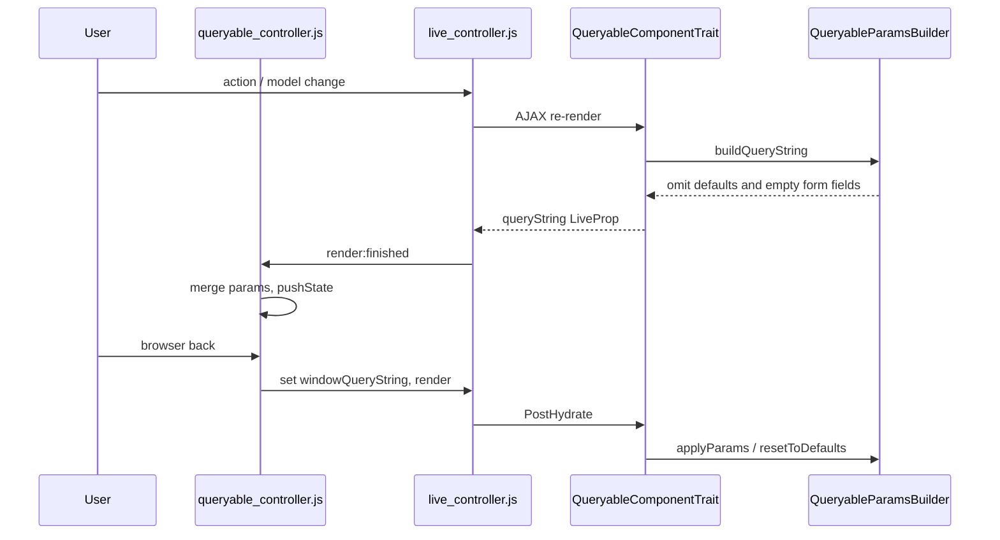
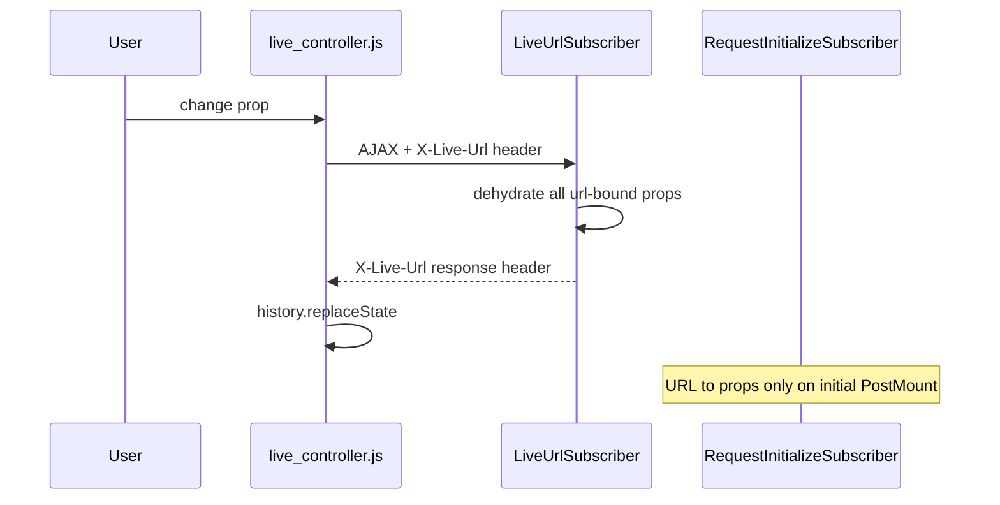

# Live Component URL sync: custom QueryableProp vs Symfony `#[LiveProp(url: …)]`

This document summarizes how [live-grid](https://github.com/symfony/live-grid) synchronizes Live Component state with the browser URL, compares that approach to Symfony UX Live Component’s native `url` option (v3.2.0), and outlines proposed upstream improvements. It is intended as background for a [symfony/ux](https://github.com/symfony/ux) discussion or PR.

**Related Symfony docs:** [Changing the URL when a LiveProp changes](https://symfony.com/bundles/ux-live-component/current/index.html#changing-the-url-when-a-liveprop-changes)

**Installed bundle version in this project:** `symfony/ux-live-component` v3.2.0

---

## Executive summary

Symfony UX Live Component’s `#[LiveProp(url: …)]` covers basic URL sync for scalar props on a **single** component instance. This grid/list use case needs more:

- Clean URLs (omit default and empty values)
- Browser back/forward that restores component state
- Multiple identical list components on one page with isolated, auto-generated namespaces
- Filter form fields synced into the URL alongside pagination props

None of that is fully achievable with the native `url` option in v3.2.0 without regressions. We built a small custom layer (`QueryableProp`) on top of Live Components. Several gaps align with open symfony/ux issues ([#2141](https://github.com/symfony/ux/issues/2141), [#3149](https://github.com/symfony/ux/issues/3149)) and maintainer feedback. We would prefer to migrate to upstream once parity exists.

---

## This custom implementation

### Architecture

```
User action -> live_controller.js (AJAX re-render)
           -> QueryableComponentTrait (PreReRender: build queryString)
           -> QueryableParamsBuilder (omit defaults / empty form fields)
           -> queryable_controller.js (merge URL, pushState)

Browser back -> popstate -> queryable_controller.js
            -> windowQueryString LiveProp -> PostHydrate
            -> applyParams / resetToDefaults
```

### Key files

| Piece     | Path                                                             | Role                                                               |
|-----------|------------------------------------------------------------------|--------------------------------------------------------------------|
| Attribute | `src/Component/LiveComponent/Attribute/QueryableProp.php`        | Marks properties (and optional `fieldName`) for URL sync           |
| Builder   | `src/Component/LiveComponent/Service/QueryableParamsBuilder.php` | Build/apply query params; skip defaults and empty form values      |
| Trait     | `src/Component/LiveComponent/Trait/QueryableComponentTrait.php`  | Mount hydration, component namespace, popstate handling, form hook |
| Stimulus  | `assets/controllers/queryable_controller.js`                     | `pushState`, `popstate`, per-component namespace merge             |
| Example   | `src/Component/User/LiveComponent/Admin/UserListComponent.php`   | Grid list with pagination + filter form                            |
| Demo page | `templates/Admin/Crud/index.html.twig`                           | Two independent lists on one page                                  |

### URL shape

Each list instance gets an auto-generated namespace (via `DeterministicTwigIdCalculator` when `generateUniqueComponentName = true`):

```
/admin/users/?live-abc123[page]=2&live-def456[page]=3&live-abc123[user_list_filter][email]=admin%40example.com
```

- Default values (`page=1`, `resultsPerPage=10`) are **omitted**
- Empty filter fields are **omitted**
- Each component only removes keys under its own namespace when updating the shared page URL

### Behaviour I rely on

1. **Omit defaults** - `page=1` and `resultsPerPage=10` never appear in the URL.
2. **Omit empty form fields** - filter inputs that are blank/null/empty array are excluded.
3. **Reset on missing keys** - when a param disappears from the URL (e.g. browser back), the prop resets to its PHP default.
4. **`pushState`** - each state change creates a history entry (not `replaceState`).
5. **`popstate`** - back/forward re-hydrates the component from `window.location.search`.
6. **Multi-instance** - two `admin:user_list` components on one page without manual `alias` props.
7. **Form integration** - Symfony `FormView` fields are serialized into the component namespace (nested under the form name).

### Tests (reproducer assets)

| Layer       | Test file                                         | What it proves                                             |
|-------------|---------------------------------------------------|------------------------------------------------------------|
| Unit        | `tests/Component/QueryableParamsBuilderTest.php`  | Default omission, form field omission/inclusion            |
| Integration | `tests/Component/QueryableComponentTraitTest.php` | Mount hydration, popstate reset                            |
| Functional  | `tests/User/AdminUserListFunctionalTest.php`      | Server-side hydration, dual-list isolation                 |
| E2E         | `tests/E2e/Admin/UserListUrlSyncE2eTest.php`      | `pushState`, reload, dual-list merge, browser back/forward |

---

## Symfony native `#[LiveProp(url: …)]` (v3.2.0)

### How it works

1. **Mount:** `RequestInitializeSubscriber` reads flat query/path params and hydrates url-bound props via `LiveComponentHydrator`.
2. **Update:** Frontend sends `X-Live-Url` header with current location on each AJAX request.
3. **Response:** `LiveUrlSubscriber` dehydrates **all** url-bound props, merges them into the previous query string, returns new URL in `X-Live-Url` response header.
4. **Client:** `live_controller.js` calls `history.replaceState()` with the new URL.

### Relevant vendor classes

- `vendor/symfony/ux-live-component/src/EventListener/LiveUrlSubscriber.php`
- `vendor/symfony/ux-live-component/src/EventListener/RequestInitializeSubscriber.php`
- `vendor/symfony/ux-live-component/src/Util/RequestPropsExtractor.php`
- `vendor/symfony/ux-live-component/assets/dist/live_controller.js`

### What Symfony already supports well

- Flat query param binding: `#[LiveProp(writable: true, url: true)]`
- Custom param names: `url: new UrlMapping(as: 'q')`
- Dynamic names / multi-instance (manual): `modifier` + `alias` Twig prop
- Path segment binding: `UrlMapping(mapPath: true)`
- Typed hydration (entities, arrays, objects) via the hydrator system
- Merging with existing query params on the page (full URL in `X-Live-Url`)

### Documented behaviour I cannot use as-is

From the official docs:

> *"To ensure the state is fully represented in the URL, all bound props will be set as query parameters, even if their values didn't change."*

Example: changing only `query` still produces `?query=…&mode=fulltext`.

---

## Feature parity matrix

| Capability                                 | QueryableProp (this)          | Symfony `url` (v3.2.0)                                                |
|--------------------------------------------|-------------------------------|-----------------------------------------------------------------------|
| Sync prop changes to URL                   | Yes (`pushState`)             | Yes (`replaceState`)                                                  |
| Full page reload restores state            | Yes                           | Yes                                                                   |
| **Browser back/forward updates component** | Yes                           | **No** - [symfony/ux#3149](https://github.com/symfony/ux/issues/3149) |
| **Omit default values**                    | Yes                           | **No** - [symfony/ux#2141](https://github.com/symfony/ux/issues/2141) |
| **Omit empty form fields**                 | Yes                           | No built-in                                                           |
| **Reset missing URL keys to defaults**     | Yes                           | No - only sets keys present in URL                                    |
| Two same components on one page            | Auto namespace `live-id[key]` | Manual `alias` / `modifier` -> flat `prefix-key`                      |
| Merge URL across multiple components       | Yes (namespace-scoped)        | Yes (merge full previous query string)                                |
| Filter form fields in URL                  | Yes via `FormView`            | No - per-field `url` or custom dehydrate                              |
| Path segment binding                       | No                            | Yes (`mapPath`)                                                       |
| Typed entity hydration                     | PropertyAccessor              | `LiveComponentHydrator`                                               |

### Conclusion

**I cannot replace this implementation with Symfony’s native `url` option today** without losing:

- Clean URLs
- Browser history integration
- Automatic multi-instance namespacing
- Filter form URL sync

A single list with flat params and always-visible defaults is approximable, but that is not my target UX.

---

## Upstream enhancement proposals

These align with existing community requests and maintainer comments on symfony/ux.

### Proposal A - `UrlMapping::omitDefault` (or Livewire-style `keep`)

**Problem:** [symfony/ux#2141](https://github.com/symfony/ux/issues/2141) - all bound props always appear in the URL, including unchanged defaults.

**Suggested API:**

```php
#[LiveProp(writable: true, url: new UrlMapping(omitDefault: true))]
public int $page = 1;
```

**Server changes:**

- `LiveUrlSubscriber::extractUrlLiveProps` - skip props equal to their PHP default when `omitDefault: true`
- `LiveUrlSubscriber::generateNewLiveUrl` - **remove** keys for omitted props from the merged query string (not only stop adding them)
- `RequestInitializeSubscriber` - when a key is absent and `omitDefault: true`, reset the prop to its default value

**Reference:** Livewire’s [`keep` option](https://livewire.laravel.com/docs/url#display-on-page-load) (mentioned in #2141 discussion).

### Proposal B - Browser history: `pushState` + `popstate` hydration

**Problem:** [symfony/ux#3149](https://github.com/symfony/ux/issues/3149) - URL changes via `replaceState`; back button does not restore component state.

**Partial solution in docs (not in my locked v3.2.0):** `#[AsLiveComponent(pushHistoryState: true)]` for `pushState` instead of `replaceState`.

**Still missing:** a `popstate` listener in `live_controller.js` that:

1. Reads `window.location.search`
2. Maps values to url-bound LiveProps (using existing url mappings)
3. Triggers a re-render

My equivalent: `windowQueryString` LiveProp + `updatePropsAfterHistoryChanges()` in `QueryableComponentTrait`.

**Without popstate, `pushHistoryState` alone leaves component state stale on back.**

### Proposal C - Auto namespace for multi-instance (optional, larger scope)

**Problem:** Using the same component twice requires manual `alias` props and flat prefixed param names.

**Suggested API:**

```php
#[AsLiveComponent(urlNamespace: true)] // uses deterministic live-id as query prefix
// ?live-abc[page]=2  instead of  ?page=2
```

Touches `LiveUrlSubscriber`, `RequestPropsExtractor`, and possibly `LiveControllerAttributesCreator`.

### Out of core scope - form filter URL sync

Iterating `FormView` to build nested query params is application-specific. I would keep this as app-level glue (or a small bridge package) even after migrating scalars to native `url`.

---

## Hybrid / migration path

| Layer                    | Move to Symfony `url` now? | Notes                                                      |
|--------------------------|----------------------------|------------------------------------------------------------|
| `page`, `resultsPerPage` | No                         | Defaults would pollute URL; back/forward broken            |
| Filter form values       | No                         | Keep `QueryableParamsBuilder` + `applyQueryableFormParams` |
| URL write / history JS   | No                         | Keep `queryable_controller.js` until Proposal B lands      |
| `fieldName` / `modifier` | N/A                        | `LiveProp` already has equivalent APIs                     |

**Important:** Do not enable both systems on the same component - Symfony `X-Live-Url` and my `queryable_controller.js` would fight over `history`.

### Staged migration (after upstream parity)

1. Upgrade `symfony/ux-live-component` when Proposals A + B merge.
2. Replace `#[QueryableProp]` with `#[LiveProp(url: new UrlMapping(omitDefault: true))]` on scalar props.
3. Keep a thin trait for `FormView` -> query params only.
4. Remove `queryable_controller.js` once native `popstate` (+ optional namespace from Proposal C) exist.
5. Delete `queryString`, `windowQueryString`, and `componentName` machinery.

### Reproducer repository

This POC repository (`live-grid`) contains a minimal working implementation and the test suite listed above. A stripped-down reproducer could be extracted from:

- `tests/Fixtures/Component/QueryableTestComponent.php`
- `tests/Component/QueryableParamsBuilderTest.php`
- `tests/E2e/Admin/UserListUrlSyncE2eTest.php`

---

## Sequence diagrams

### This flow



### Symfony native flow (v3.2.0)



---

## References

- [Symfony UX Live Component - URL binding docs](https://symfony.com/bundles/ux-live-component/current/index.html#changing-the-url-when-a-liveprop-changes)
- [symfony/ux#2141 - Not write url query param when empty/default](https://github.com/symfony/ux/issues/2141)
- [symfony/ux#3149 - URL linked LiveProps don't honour browser back button](https://github.com/symfony/ux/issues/3149)
- [symfony/ux PR #2673 - mapPath for LiveProp URL binding](https://github.com/symfony/ux/pull/2673)
- [Livewire URL docs (`keep` option)](https://livewire.laravel.com/docs/url#display-on-page-load)
